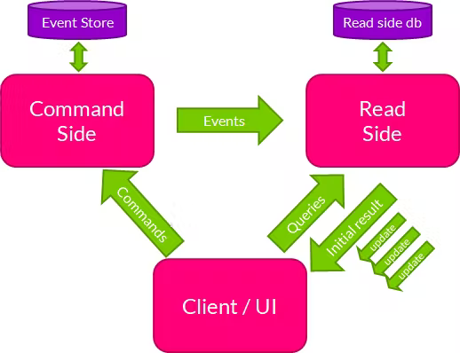

# Intro

### Microservices

- a variant of SOA (service-oriented architecture) architectural style that structures an application as a collection of
  loosely coupled services
- in a microservice architecture, services are fine grained
- the benefit of decomposing an application into different smaller services is that it improves modularity; an
  application is easier to understand, develop, test and become more resilient to architecture erosion
- it enables the parallel development by enabling small autonomous teams to develop, deploy adn scale their respective
  services independently

- It is a web service that is responsible for one thing (single-responsibility principle)
- configured to work in the cloud and is easily scalable
- database per service pattern
- service discovery (register of the microservices that dynamically tracks their status and health)
- API gateway
- load balancer
- config server

- HTTP communication (synchronous communication) and event-driven type of communication (producer/consumer,
  publisher/subscriber) (asynchronous communication)

### Transactions

- ACID

    - Atomicity (all or nothing)
    - Consistency (the data is in a consistent state before the transaction starts and after it finishes)
    - Isolation (transactions appear to be independent, they do not know for other transactions happening)
    - Durability (after the transaction is committed, that is an ever-lasting state, until the another transaction
      possible changes that)

- The distributed transaction
    - SAGA
        - Choreography-based SAGA
        - Orchestration-based SAGA

#### Choreography-based SAGA

- microservices exchange events
- the idea is that in a transaction, there is an order of execution between services, and each microservice when it
  completes its job, it produces a new event that the next microservice in the stream expects to receive
- For an example:

```
BEGIN transaction
1. Create a new order
2. Reserve product in stock
3. Process payment
4. Create shipment order
END transaction
```

TODO: image goes here


If some "local" transaction fails, e.g. the payment processing failed, the Payment microservice should produce an event
to compensate (rollback) that failure. A service that preceedes the payment processing is subscribed to that event and
it will react (at the end it will produce an event that is listened by the previous service etc.). So the compensating
events are produced in a reversed order.

```
Initial flow:
1. Create an order
2. Reserve product
```

```
Compensating flow:
1. Cancel product reservation
2. Reject an order
```

TODO: image goes here


#### Orchestration-based SAGA

- we have a component in the initiator service of the transaction that acts as a SAGA manager and orchestrates the
  execution of the "local" transactions and it reacts to every event that confirms the execution of the local
  transaction
  TODO: image goes here
  

- what if something goes wrong
    - when the service which action failed, publishes an event states an action failure, SAGA listens to that and
      publishes the next event that will be picked up the service preceeding the one which action failed and it will
      then make its rollback and publish the next event to trigger the next rollback
    - all rollback events are made in the reverse order and are caught by the SAGA component

### Frameworks

- eventuate:
    - Eventuate tram - based on JPA/JDBC
    - Eventuate local - an event sourcing framework
- Axon
    - Open-source framework for event-driven design microservices and domain-driven design

### CQRS - Command Query Responsibility Segregation

- we have two parts of the system:
    - commands - creates/updates/deletes some records
    - queries - reads the data
- the messaging protocol will transfer the data between the command and query subsystem
- Location transparency (services do not know about each other's location)

- Types of messages in CQRS:
    - commands - an intent to make a change (named in imperative manner) - CreeateProductCommand, UpdateProductCommand,
      DeleteProductCommand
    - query - express a desire to query records - FindProductQuery, GetProductQuery
    - event - notification that something happened - ProductCreatedEvent, ProductDeletedEvent, ProductUpdatedEvent

### Event sourcing

- traditional way of creating records:
    - create a product - it creates a new record in the database
    - update a product - it updates the existing record in the database, it's not creating a new one
    - update a product - the same story again
- event sourcing:
    - create a product - creates a new record/event in a log-based fashion with the necessary details
    - update a product - creates a new record/event in a log-based fashion with the necessary details
    - update a product - creates a new record/event in a log-based fashion with the necessary details
      So, every entity-based operation is created and recorded in the database
      ```
      eventIdentifer, eventType, eventPayload
      1, ProductCreatedEvent {"productId": "135fe", "title": "Spoon","price":1}
      ```
      This database is called an **event store**. Apart from having the final state, we also have a series of the events
      that produced this state (for audit or reconstructing the state). These events should be ordered properly.

This concept is applied to CQRS in the following manner. Let's say someone created a new product

1. this `ProductCreatedEvent` will be stored on Command's side - stored as an event in the event store
2. that event will be published to the queue where it will be picked up by the Query side which will create a new record
   in its read database (it will have only one record for that product that will be updated in case the
   ProductUpdatedEvent for that product is published, so only the latest state is stored)

### Axon


- Download Axon jar and run axonserver.jar
- Config parameters are listed in axonserver.properties

```
# 8024 - HTTP communication
# 8124 - gRPC communication
docker run --name axonserver -p 8024:8024 -p 8124:8124 -v "<path-on-local-machine>/data":/data -v 
"<path-on-local-machine>/eventdata":/eventdata -v "<path-on-local-machine>/config":/config axoniq/axonserver
```

```
docker run --name axonserver -p 8024:8024 -p 8124:8124 -v /home/nenad/Documents/Learning/event-driven-microservices-cqrs-saga-axon-sb/docker-data/data:/data -v /home/nenad/Documents/Learning/event-driven-microservices-cqrs-saga-axon-sb/docker-data/eventdata:/eventdata -v /home/nenad/Documents/Learning/event-driven-microservices-cqrs-saga-axon-sb/docker-data/config:/config axoniq/axonserver
```

### Spring Cloud API Gateway

- it has a built-in load balancer

### CQRS implementation

- Client application sends a command to `Command Bus` and on the end there is a concrete Command Handler
  that processes those commands and convert them to Domain objects that are stored as events by repository in an event
  store
  

- Aggregate class holds the current state of the object
- command handler is a good place to validate commands

#### Querying the objects

- Client -> Controller -> Query Gateway -> Query Bus -> Query handler -> JPA repository -> Database

#### Set based consistency

- Command and query segments are separated. How do we validate e.g. if the user email already exists when creating a new
  user
- we can create a system command that will not be exposed outside to do the lookup in the database
- message dispatch interceptor will intercept commands where the user email e.g. can be change (create account, update
  account)
- we will have a dedicated event handler to react on it and lookup the user email details in the database

#### Error handling

1. Rest controller
2. Message interceptor
3. Command handler<br>
   `Controller advice`

---

4. Event handler -> subscribing `@ProcessingGroup` <br>
   `@ExceptionHandler`

- event processor
    - a component that handles the provision of the events to the event handlers
    - two types:
        - tracking event processor - pull their message from a source using a thread that it manages itself (a different
          thread); if something fails, it will retry processing the event using an incremental backoff period
        - subscribing event processor - subscribe themselves to a source of events and are invoked by the thread manager
          by the publishing mechanism (the same thread); will have the exception bubble up to the publishing component
          of the event<br>
          To roll back the propagated exception we should use a subscribing event processor

### SAGA

#### Orchestration-based SAGA

1. Order controller
2. Order aggregate
3. Order saga
    - Handle OrderCreatedEvent
    - ReserveProductCommand -> Product service
    - ProductReservedEvent <- Product service
    - ProcessPaymentCommand -> Payment service
    - PaymentProcessedEvent <- Payment microservice

Saga example:

```java
import com.npdev.estore.order_service.core.event.OrderCreatedEvent;
import org.axonframework.commandhandling.gateway.CommandGateway;
import org.axonframework.modelling.saga.EndSaga;
import org.axonframework.modelling.saga.SagaEventHandler;
import org.axonframework.modelling.saga.StartSaga;
import org.axonframework.spring.stereotype.Saga;
import org.springframework.beans.factory.annotation.Autowired;

@Saga
public class OrderSaga {

    @Autowired
    private transient CommandGateway commandGateway;

    @StartSaga
    @SagaEventHandler(associationProperty = "orderId")
    public void handle(OrderCreatedEvent orderCreatedEvent) {
        //
    }

    @SagaEventHandler(associationProperty = "productId")
    public void handle(ProductReservedEvent productReservedEvent) {
        //
    }

    @SagaEventHandler(associationProperty = "paymentId")
    public void handle(PaymentProcessedEvent paymentProcessedEvent) {
        //    
    }

    @EndSaga
    @SagaEventHandler(associationProperty = "orderId")
    public void handle(OrderApprovedEvent orderApprovedEvent) {
        // 
    }
}
// associationProperty is used to map the right saga instance to its event
// multithreading system means that multiple sagas are being executed at the same time
// associations can be made with

// associateWith(key, value);
// removeAssociation(key, value);
// to end Saga programatically
// end()
```

- Compensating transactions
    - if we need to rollback transactions, we need to make compensating transactions to undo the changes my them:
        1. rollback happens in the reverse order from the actual modifications
        2. transactions that did not make any alterations do not need to be rolled back
- on the command side, we do not delete the events from the store, we just add them (we add a new event when we make a
  rollback)

#### Deadlines

- Deadline is an event that takes place in an absence of an event - e.g. if we expect that some event is published in
  24hrs and if it's not, a deadline event can happen
- can be used in Saga, as well as outside of Saga (can happen in aggregate as well)
- triggers a state change or a command
- is not source - not saved in an event store
- triggered only once

```java

// SimpleDeadlineManager keeps deadlines stored in-memory, so if JVM restarts, those deadlines will be lost

import org.springframework.context.annotation.Bean;

@Bean
public DeadlineManager deadlineManager(Configuration configuration,SpringTransactionManager transactionManager){
        return SimpleDeadlineManager.builder()
        .scopeAwareProvider(new ConfigurationScopeAwareProvider(configuration))
        .transactionManager(transactionManager)
        .build();
        }

// QuartzDeadlineManager stores deadlines in some persistent storage, meaning upon JVM restart those will not be lost
// more suitable for longer deadlines e.g. 7 days
@Bean
public DeadlineManager deadlineManager(Schedule scheduler,
        AxonConfiguration configuration,
        SpringTransactionManager transactionManager,
        Serializer serializer){
        return QuartzDeadlineManager.builder()
        .scopeAwareProvider(new ConfigurationScopeAwareProvider(configuration))
        .serializer(serializer)
        .transactionManager(transactionManager)
        .scheduler(scheduler)
        .build();
        }

```

- Schedule a new deadline

```java
import org.springframework.beans.factory.annotation.Autowired;

@Autowired
private transient DeadlineManager deadlineManager;
// ...

        deadlineManager.schedule(Duration.of(2,ChronoUnit.DAYS),"deadline-name",productReservedEvent);
```

- Handle a deadline

```java
import org.axonframework.deadline.annotation.DeadlineHandler;

@DeadlineHandler
public void handlePaymentDeadline(ProductReservedEvent productReservedEvent){
        // send a compensating command
        }
```

#### Subscription queries

- as the update propagation between the command and the query side is asynchronous, that means the changes are eventual
- if we query the query side after we have sent a command, it may be it will take some time to propagate these changes
- subscription query is a pattern in CQRS to first get an initial result and then the query side can send updates as
  they are reflected (we subscribe to event changes)
- in Saga, we can use this - when the first command is sent, we can fire a query right after it to get the initial
  result, and after Saga is complete, we can emit the result
  

#### Snapshots

- if we want to replay the whole event store, in case there are a lot of events, it can a lot of time
- an option to reduce that time is to take snapshots
- snapshots are recorded states of aggregate, e.g. let's say we have the following situation:

```
Create a product - price $1
Update its price - price $2
Update its price - price $3
Update its price - price $4
```

- We can make a snapshot and save the state of the product with price $4.
- Notes:
    - we can configure when to make a snapshot, e.g. every 4 events or at regular intervals
    - a snapshot is an even by itself which is made synchronously and that does not prevent other events being made
    - snapshot is the current state of an aggregate that is persisted by default (other options are possible)
- when we have snapshots, a new aggregate is made based on that snapshot and later other incoming events are applied to
  that aggregate

Snapshotting:

- regular intervals
- after x number of events
- when loading of events takes more than specified time

```java

import org.axonframework.spring.stereotype.Aggregate;

@Bean(name = "productSnapshotTriggerDefinition")
public SnapshotTriggerDefinition productSnapshotTriggerDefinition(Snapshotter snapshotter){
        return new EventCountSnapshotTriggerDefinition(snapshotter,500);
        }

@Aggregate(snapshotTriggerDefinition = "productSnapshotTriggerDefinition")
public class ProductAggregate {

}
```

### Events replay

- event is first stored in the event store and eventually that event is reflected into read database
- replay of the events is useful and can be partial (from some point) or full (from the beginning); e.g. if you want to 
populate new view table with all events that happened

- Event replays are supported only with the Tracking Event Processor
- Use `@DisallowReplay` to exclude `@EventHandler` methods during event replay
- Stop the current Tracking Event Processor
- `@ResetHandler` - called before the event replay (if an exception occurs here, an event replay will be canceled)
- Sagas are (by default) not replayable