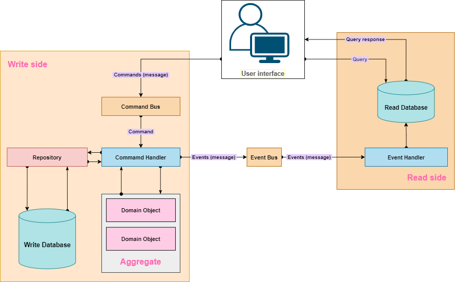

# Intro

### Microservices

- a variant of SOA (service-oriented architecture) architectural style that structures an application as a collection of
  loosely coupled services
- in a microservice architecture, services are fine grained
- the benefit of decomposing an application into different smaller services is that it improves modularity; an
  application is easier to understand, develop, test and become more resilient to architecture erosion
- it parallelizes the development by enabling small autonomous teams to develop, deploy adn scale their respective
  services independently

- It is a web service that is responsbile for one thing (single-responsibility principle)
- configured to work in the cloud and is easily scalable
- database per service pattern
- service discovery (register of the microservices that dynamically tracks their status and health)
- API gateway
- load balancer
- config server

- HTTP communication (synchronous communication) and event-driven type of communication (producer/consumer,
  publisher/subscriber) (asynchronous communication)

### Transactions

- ACID

    - Atomicity (all or nothing)
    - Consistency (the data is in a consistent state before the transaction starts and after it finishes)
    - Isolation (transactions appear to be independent, they do not know for other transactions happening)
    - Durability (after the transaction is committed, that is an ever-lasting state, until the another transaction
      possible changes that)

- The distributed transaction
    - SAGA
        - Choreography-based SAGA
        - Orchestration-based SAGA

#### Choreography-based SAGA

- microservices exchange events
- the idea is that in a transaction, there is an order of execution between services, and each microservice when it
  completes its job, it produces a new event that the next microservice in the stream expects to receive
- For an example:

```
BEGIN transaction
1. Create a new order
2. Reserve product in stock
3. Process payment
4. Create shipment order
END transaction
```

TODO: image goes here


If some "local" transaction fails, e.g. the payment processing failed, the Payment microservice should produce an event
to compensate (rollback) that failure. A service that preceedes the payment processing is subscribed to that event and
it will react (at the end it will produce an event that is listened by the previous service etc.). So the compensating
events are produced in a reversed order.

```
Initial flow:
1. Create an order
2. Reserve product
```

```
Compensating flow:
1. Cancel product reservation
2. Reject an order
```

TODO: image goes here


#### Orchestration-based SAGA

- we have a component in the initiator service of the transaction that acts as a SAGA manager and orchestrates the
  execution of the "local" transactions and it reacts to every event that confirms the execution of the local
  transaction
  TODO: image goes here
  

- what if something goes wrong
    - when the service which action failed, publishes an event states an action failure, SAGA listens to that and
      publishes the next event that will be picked up the service preceeding the one which action failed and it will
      then make its rollback and publish the next event to trigger the next rollback
    - all rollback events are made in the reverse order and are caught by the SAGA component

### Frameworks

- eventuate:
    - Eventuate tram - based on JPA/JDBC
    - Eventuate local - an event sourcing framework
- Axon
    - Open-source framework for event-driven design microservices and domain-driven design

### CQRS - Command Query Responsibility Segregation

- we have two parts of the system:
    - commands - creates/updates/deletes some records
    - queries - reads the data
- the messaging protocol will transfer the data between the command and query subsystem
- Location transparency (services do not know about each other's location)

- Types of messages in CQRS:
    - commands - an intent to make a change (named in imperative manner) - CreeateProductCommand, UpdateProductCommand,
      DeleteProductCommand
    - query - express a desire to query records - FindProductQuery, GetProductQuery
    - event - notification that something happened - ProductCreatedEvent, ProductDeletedEvent, ProductUpdatedEvent

### Event sourcing

- traditional way of creating records:
    - create a product - it creates a new record in the database
    - update a product - it updates the existing record in the database, it's not creating a new one
    - update a product - the same story again
- event sourcing:
    - create a product - creates a new record/event in a log-based fashion with the necessary details
    - update a product - creates a new record/event in a log-based fashion with the necessary details
    - update a product - creates a new record/event in a log-based fashion with the necessary details
      So, every entity-based operation is created and recorded in the database
      ```
      eventIdentifer, eventType, eventPayload
      1, ProductCreatedEvent {"productId": "135fe", "title": "Spoon","price":1}
      ```
      This database is called an **event store**. Apart from having the final state, we also have a series of the events
      that produced this state (for audit or reconstructing the state). These events should be ordered properly.

This concept is applied to CQRS in the following manner. Let's say someone created a new product

1. this `ProductCreatedEvent` will be stored on Command's side - stored as an event in the event store
2. that event will be published to the queue where it will be picked up by the Query side which will create a new record
   in its read database (it will have only one record for that product that will be updated in case the
   ProductUpdatedEvent for that product is published, so only the latest state is stored)

### Axon


- Download Axon jar and run axonserver.jar
- Config parameters are listed in axonserver.properties

```
# 8024 - HTTP communication
# 8124 - gRPC communication
docker run --name axonserver -p 8024:8024 -p 8124:8124 -v "<path-on-local-machine>/data":/data -v 
"<path-on-local-machine>/eventdata":/eventdata -v "<path-on-local-machine>/config":/config axoniq/axonserver
```

```
docker run --name axonserver -p 8024:8024 -p 8124:8124 -v /home/nenad/Documents/Learning/event-driven-microservices-cqrs-saga-axon-sb/docker-data/data:/data -v /home/nenad/Documents/Learning/event-driven-microservices-cqrs-saga-axon-sb/docker-data/eventdata:/eventdata -v /home/nenad/Documents/Learning/event-driven-microservices-cqrs-saga-axon-sb/docker-data/config:/config axoniq/axonserver
```

### Spring Cloud API Gateway

- it has a built-in load balancer

### CQRS implementation

- Client application sends a command to `Command Bus` and on the end there is a concrete Command Handler
  that processes those commands and convert them to Domain objects that are stored as events by repository in an event
  store
  

- Aggregate class holds the current state of the object

#### Querying the objects
- Client -> Controller -> Query Gateway -> Query Bus -> Query handler -> JPA repository -> Database